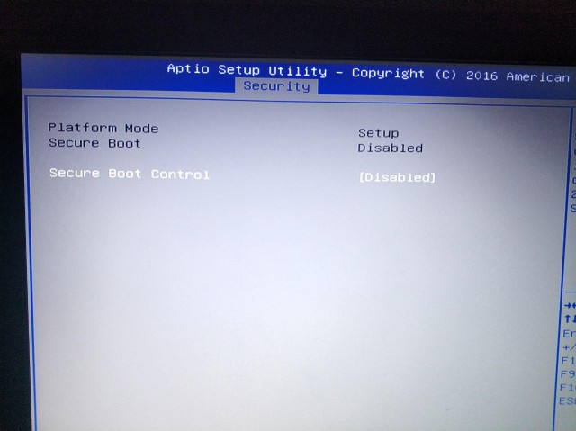
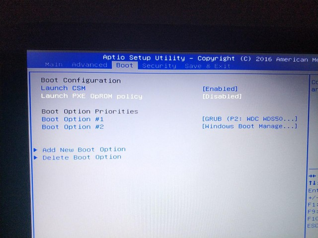
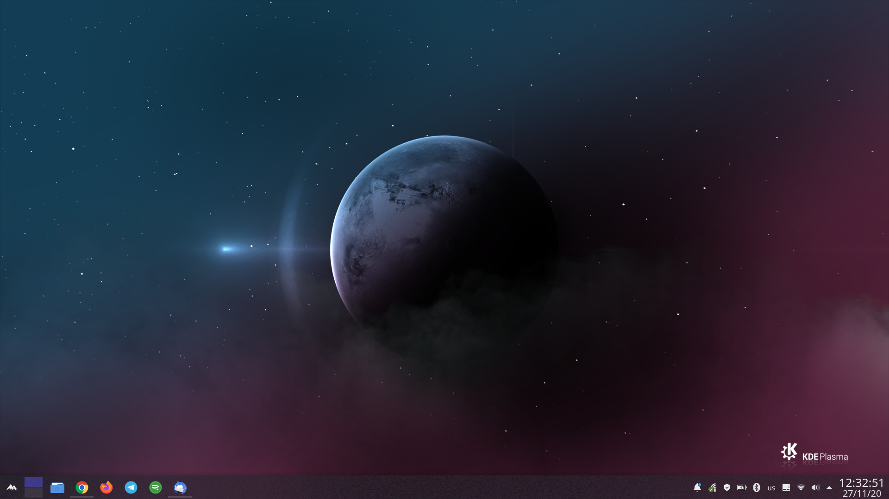
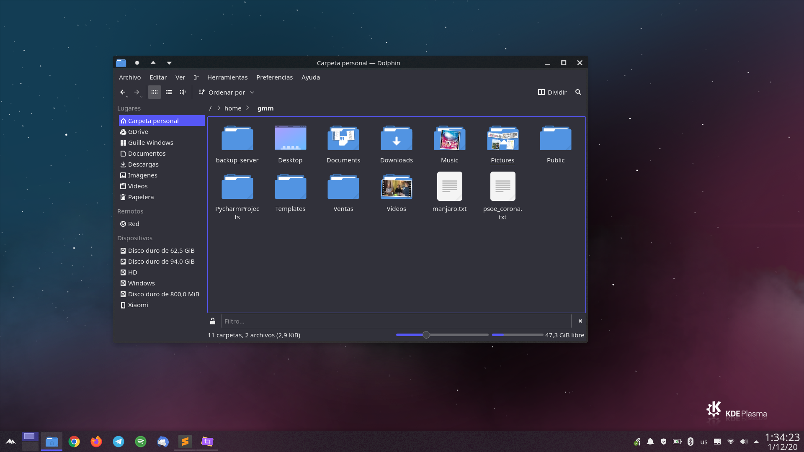
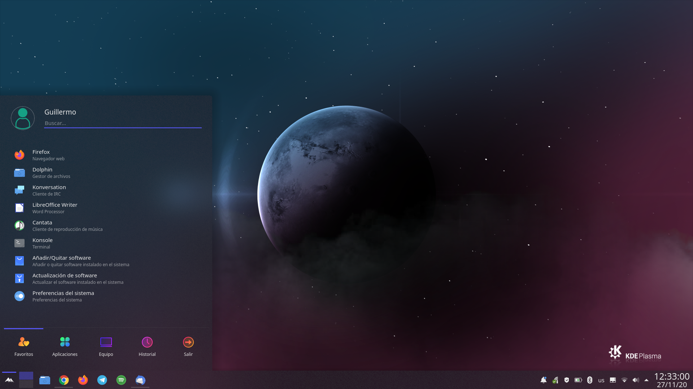
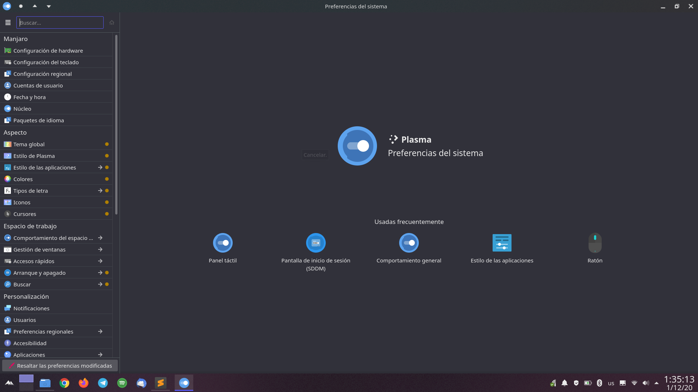

# Install dual boot Manjaro in Asus GL552VW using UEFI on SSD alongside Windows 10

Most of the people who use Linux have their system installed in the same disk as a Windows installation. This dual boot configuration often goes wrong, as it was my case, so after some research in internet, here's how to do it properly.
To clarify, this set up would be with an **Asus GL552VW** with two disk: Samsung EVO 860 SSD for the OS, previous HDD for the data.

I'm making this as I had a lot of problems trying to boot in UEFI: usb getting grub rescue with *Unknown filesystem* error code, SSD getting a stuck at boot after a fresh install, etc. One of these troubles was I wasn't able to boot in the usb in UEFI mode. I tried changing every BIOS parameter and nothing worked, so I decided to boot in ACPI (BIOS) mode, install Manjaro in this mode and then install the EFI support. If you can boot the usb in UEFI mode, you just have to install the OS and EFI support will be available. But, if your case is similar to mine and you cannot boot any usb in UEFI mode, follow next steps.

## BIOS settings, disk format and Windows set up

First of all, boot into the BIOS and disable **Secure Boot** option in the security options if you haven't done it before. Don't exit the BIOS yet.

If you cannot boot in UEFI, switch *Launch CSM* option in boot menu to enabled and be sure *Launch PXE OpROM policy* is disabled. BIOS settings is ok for now.

We start from an empty SSD disk. We would need to use **GPT** partition table for this disk, as we want to set it up with a UEFI boot system.
For that task, we can boot from a Windows usb bootable (use Windows media creation tool) and install the OS using the typical *next-clicking* installer, setting the correct size for this system (I'm using a 500GB SSD, so 300-350GB it's ok for me for Windows) and GPT.

The installer will create 4 partitions, usually in this order:

| Device    | Start  | End   | Size   | Filesystem | Info                         | Flags        |
|:---------:|:------:|:-----:|:------:|:----------:|:----------------------------:|:------------:|
| /dev/sdb1 | 1049kB | 524MB | 523MB  | ntfs       | Basic data partition         | hidden, diag | 
| /dev/sdb2 | 524MB  | 629MB | 105MB  | fat32      | EFI system partition         | boot, esp    | 
| /dev/sdb3 | 629MB  | 646MB | 16,8MB |            | Microsoft reserved partition | msftres      |
| /dev/sdb4 | 646MB  | 323GB | 322GB  | ntfs       | Basic data partition         | msftdata     |

It's important to remember the second partition, as it's the **ESP (EFI System Partition)** partition where we will need to install the grub in afterwards.

When Windows is installed, we need to disable the **Hibernation** (which also disables the **Fast Boot**). Disabling also Hibernation, we avoid any kind of problem mounting the Windows partition on our Linux system in a future. For that issue, boot up the system and open a cmd window with admin privileges and run the next command:

    > powercfg.exe /hibernate off

We can also run this command to force Windows to use UTC time. This would help us for making sure the time is the same in both OS.
  
    > REG ADD HKEY_LOCAL_MACHINE\System\CurrentControlSet\Control\TimeZoneInformation /v RealTimeIsUniversal /t REG_DWORD /d 1
    

## Manjaro installation

Most people have just Windows installed in their system. If it's your case and you want to install Manjaro, you have to be sure your disk have GPT and disable the hibernation.

As I said, there're no way for me to boot the manjaro bootable usb in UEFI mode, so I needed to install it first in **ACPI (BIOS)** mode and **then install EFI system**.
Plug the usb, boot your Asus and press ESC to select the USB. Manjaro installation grub will appear, keep options like that and boot.
Install Manjaro using the installation wizard. I always prefer **manual partitioning** to set different partitions for /, /boot and /home (at least). These are the partitions I used:

| Device    | Size    | Filesystem | Mount point | 
|:---------:|:-------:|:----------:|:-----------:|
| */dev/sdb1* | *523MB* | *ntfs*       |             <td rowspan=4> *Installed by W10. Do not modify* | 
| */dev/sdb2* | *105MB*   | *fat32*      |             |  
| */dev/sdb3* | *16,8MB*  |            |             |  
| */dev/sdb4* | *322GB*   | *ntfs*      |             |  
| **/dev/sdb5** | 94GB    | **ext4**       | **/**           <td rowspan=4> Linux partitions to create | 
| **/dev/sdb6** | 800MB   | **ext4**       | **/boot**       |
| **/dev/sdb7** | 8GB     | **linuxswap**  |       | 
| **/dev/sdb8** | 65.5GB  | **ext4**       | **/home**       | 

If you use the manual partitioning, don't select any flag creating these partitions, as it's not needed and it could be wrong later. Before going to the next step, select the **ESP partition** (/dev/sdb2) in the installation wizard, click in edit and be sure the flags *boot* and *esp* are clicked. If not, do it and proceed to install.

When the install finishes, don't reboot the computer as it will not boot with the default grub options. As we still are using the usb bootable, we can mount the system and modify the **grub** for a proper boot.

Open a terminal, mount your system and *chroot* on it:

        $ sudo mount /dev/sdb5 /mnt
        $ sudo mount /dev/sdb6 /mnt/boot
        $ manjaro-chroot

Open /etc/default/grub and modify **GRUB_CMDLINE_LINUX_DEFAULT**, adding next kernel parameters:

        acpi=force acpi_osi= acpi_backlight=vendor i915.preliminary_hw_support=1 intel_idle.max_cstate=1 noalpic
        
After that, save and update grub and umount the filesystems.
        
        $ sudo update-grub
        $ sudo umount /mnt -R
        
Boot the system and everything should be well. We have now a Manjaro fresh installation in ACPI (BIOS) mode, so we need to change it to UEFI.

## Change Manjaro from ACPI to UEFI

For this task we can use the entry that is in the [Manjaro documentation](https://wiki.manjaro.org/index.php?title=UEFI_-_Install_Guide#Switching_from_BIOS_to_UEFI). Follow all steps and remember our EFI partition is /dev/sdb2. Maybe you get some warnings while using command *grub-install*, don't mind about them if they're just warnings. 

        $ sudo pacman -S efibootmgr grub dosfstools
        $ sudo mkdir /boot/efi
        $ sudo mount /dev/sdb2 /boot/efi
        $ sudo grub-install --target=x86_64-efi --efi-directory=/boot/efi --bootloader-id=manjaro --recheck
        $ sudo update-grub
        
Take in care you maybe need to run these commands in *chroot* if some error is found in fresh installed Manjaro with `grub-install`. This is because we cannot modify some ESP files while system is booted up. In that case, mount root partition, chroot in it with `manjaro-chroot` and execute last commands. Don't forget to exit chroot/umount partitions when the configuration is done.

After that, reboot the system and boot into the BIOS. Disable the option *Launch CSM* to avoid any BIOS boot system and select the new Linux bootloader option if exists. If not, go to *Boot menu* -> *Add new boot option* and select the file grubx64.efi in path */EFI/manjaro/*. Set a name to that bootloader, save and boot it up.

So both systems are now installed, included grub to select the OS we want to boot up. 
Maybe Windows 10 entry isn't shown in grub OS list. If it's your case, check there's a file called **bootmgfw.efi** in */EFI/Microsoft/Boot/* in ESP partition (*/dev/sdb2*). If exists and no entry appears in grub, your Windows bootloader may be broken, but you'll probably be able to save it. Create a new menu entry in your grub by creating file /etc/grub.d/40_custom and saving after pasting the following text. Of course, you need to update the grub afterwards.

    menuentry "Windows 10" --class windows {
	    search --set=root --file /EFI/Microsoft/Boot/bootmgfw.efi
	    chainloader /EFI/Microsoft/Boot/bootmgfw.efi
    }

## Manjaro optimizations

All installed, it's now time for optimizations. I chose KDE as environment due to its features and performance. I also decided to boot Manjaro every time with non-proprietary graphics drivers (*video-linux*) as I wans't able to install Nvidia drivers and boot up correctly the system; always got stuck at boot, no matter what kernel parameters I wrote to boot the system.

So if everything is ok, open a terminal and run the next commands to optimize our OS:

        $ sudo gpasswd -a <your-user> wheel             # Adding our user to sudo group
        $ sudo pacman-mirrors --fasttrack 5             # Select up-to-date mirrorlist
        $ sudo pacman -Syyu                             # Update system
        $ sudo pacman -S yay                            # Install yay AUR package manager
        $ sudo pacman -S base-devel bash-completion     # Install some needed tools
        $ sudo pacman -S packagekit-qt5                 # Install needed dependency for dolphin plugins/services
        $ sudo pacman -S traceroute                     # There're always bugs to trace
        $ yay -S ttf-ms-fonts                           # Install Microsoft fonts
        
If your system also uses a SSD disk, **continuous TRIM** is enabled by default in Linux. It's known by the last years it's bad for our SSD performance in a long time, so we can disable it and enable **periodic TRIM**. Open */etc/fstab* and remove all **discard** parameters from the mount options in fstab file. After that, save the file, run next command and reboot:

        $ sudo systemctl enable fstrim.timer
        $ reboot

Modern computers may have a large amount of RAM. If it's your case, you would maybe want to reduce the probabilty your system uses the swap memory instead of the RAM memory. **Swappiness** value goes from 0 to 100. Run the following command to modify it. I selected 10%, but you're free to choose the value you consider. Settings will be taken in count after rebooting.
        
        $ sudo sh -c "echo -e \"vm.swappiness=10\" >> /etc/sysctl.d/100-manjaro.conf"
        
You can mount your Windows filesystem or an additional hard drive in Linux by using the file manager. Anyway, if you want to mount them every time you boot up Manjaro, you can do it by editing the **/etc/fstab** file. Run:

        $ wuuid=$(sudo blkid -o value -s UUID /dev/sdb4)
        $ sudo mkdir /run/media/<your_linux_user>/Windows -p
        $ sudo sh -c "echo -e \"UUID=${wuuid}  /run/media/<your_linux_user>/Windows  ntfs-3g     rw,nosuid,nodev,allow_other,relatime 0 0\" >> /etc/fstab"
        $ hduuid=$(sudo blkid -o value -s UUID /dev/sda1)
        $ sudo mkdir /run/media/<your_linux_user>/HD -p
        $ sudo sh -c "echo -e \"UUID=${hduuid}  /run/media/<your_linux_user>/Windows  ntfs-3g     rw,nosuid,nodev,allow_other,relatime 0 0\" >> /etc/fstab"

You can also add this stuff to the **.bashrc file**. Feel free to add your personalized *alias*.
    
    # Added by user
    alias sudo='sudo '
    alias ll='ls -lsa'
    export VISUAL=vim
    source /usr/share/bash-completion/completions/*

## Theming

In my opinion, KDE is the best Linux desktop environment by far for medium or hight level computers. It offers a lot of tools and personalization. These are my theming choices and some screenshots. Selected option is marked in bold.

- Global theme: Arc Dark, Aritim-Dark, ChromeOS-dark, **Layan**, McMojave, Numix, Qogir-dark.
- Plasma style: **Layan**
- Application style -> Windows decorations: **ChromeOS-dark**
- Colors: **Layan**
- Fonts: All types +2 pts.
- Icons: **Tela dark**
- Cursors: **Arc-ICONS**
- Workspace behaviour -> Screen Locking -> Appereance: img/Minimalism_wallpaper.jpeg
- Startup and Shutdown -> Login Screen (SDDM): **Layan** with modified background (img/Minimalism_wallpaper.jpeg)
- Startup and Shutdown -> Splash Screen: **Qogir-dark**
- Desktop wallpaper: **EarthPlasma1080**

You can also install grub-customizer for installing different grub themes. For that matter, type the following command:

    sudo pacman -S grub-customizer
    
There are a lot of themes, but I recommend **Tela1080p** personally.